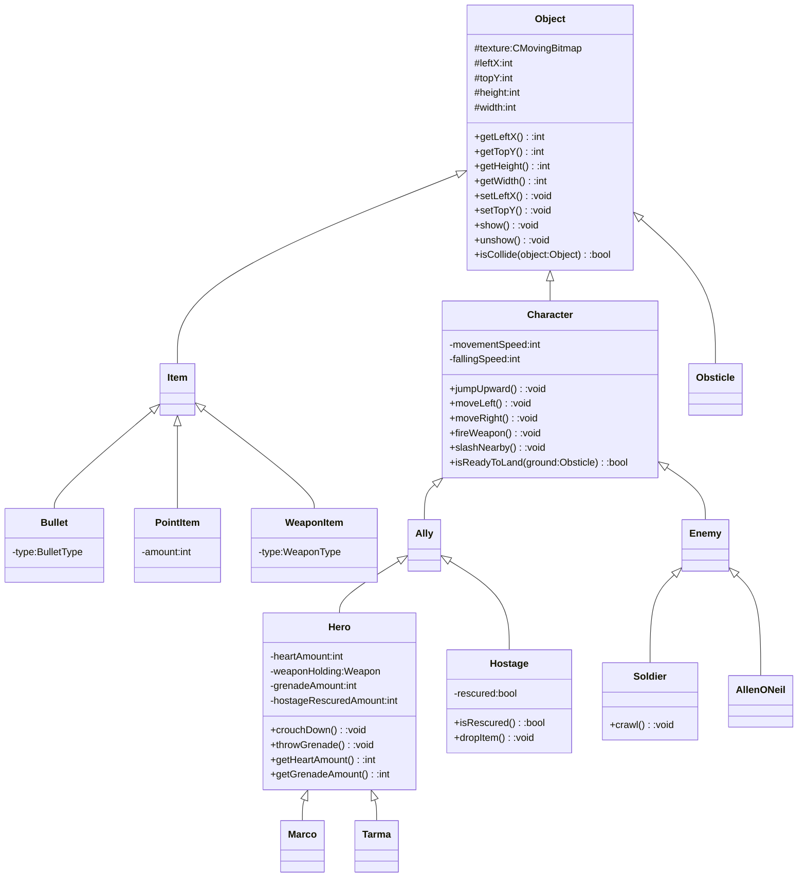

```mermaid
%% sequenceDiagram
    %% Marco->>Bullet: fireWeapon():void
    %% Bullet->>Soldier: damageTarget():void
    %% Soldier->>Bullet: fireWeapon():void
    %% Bullet->>Marco: damageTarget():void

    %% Marco->>Grenade: throwGrenade():void
    %% Grenade->>Soldier: damageTarget():void
    %% Soldier->>Grenade: throwGrenade():void
    %% Grenade->>Marco: damageTarget():void

    %% Marco->Obsticle: isCollide():bool

    %% Soldier->Obsticle: isCollide():bool

    %% Marco->>Soldier: slashNearby():void

classDiagram-v2
    class Object {
        #texture:CMovingBitmap
        #leftX:int
        #topY:int
        #height:int
        #width:int
        +getLeftX():int
        +getTopY():int
        +getHeight():int
        +getWidth():int
        +setLeftX():void
        +setTopY():void
        +show():void
        +unshow():void
        +isCollide(object:Object):bool
    }
    class Character {
        -movementSpeed:int
        -fallingSpeed:int
        +jumpUpward():void
        +moveLeft():void
        +moveRight():void
        +fireWeapon():void
        +slashNearby():void
        +isReadyToLand(ground:Obsticle):bool
    }
    class Hero {
        -heartAmount:int
        -weaponHolding:Weapon
        -grenadeAmount:int
        -hostageRescuredAmount:int
        +crouchDown():void
        +throwGrenade():void
        +getHeartAmount():int
        +getGrenadeAmount():int
    }
    class Hostage {
        -rescured:bool
        +isRescured():bool
        +dropItem():void
    }
    class Soldier {
        +crawl():void
    }
    %% HG, HMG, FS, RG...
    class Bullet {
        -type:BulletType
    }
    class PointItem {
        -amount:int
    }
    %% HG, HMG, FS, RG...
    class WeaponItem {
        -type:WeaponType
    }
    Object<|--Character
    Object<|--Item
    Object<|--Obsticle
    Character<|--Ally
    Character<|--Enemy
    Ally<|--Hero
    Ally<|--Hostage
    Enemy<|--Soldier
    Enemy<|--AllenONeil
    Hero<|--Marco
    Hero<|--Tarma
    Item<|--Bullet
    Item<|--PointItem
    Item<|--WeaponItem
```
