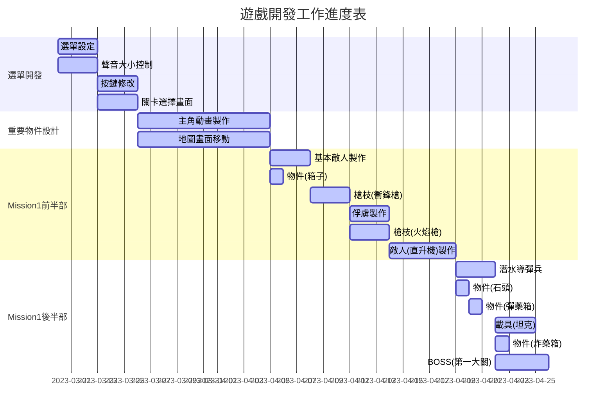

###### tags: `111-2學校上課`
# OOPL 越南大戰
## Git Branch視覺化教學
當你安裝玩Git後，你可以調用以**gitk**
使用步驟:
1. 打開cmd，cd到你專案目錄
2. 打上gitk --all &
3. 你應該會看到以下圖片

## Git 指令教學
| 使令目的 | 指令 |
| -------- | -------- | 
| 網路上複製code     | git clone repo.url    |
| 將更新的code加入stash    | git add .    |
| 新增節點    | git commit -am "變更的意義"    |
| 查看目前branch    | git branch    |
| 刪除分ㄖ   | git branch -d  branch-name  |
| 變更自己目前在的branch   | git checkout branch-name    |  變更自己目前在的branch   | git checkout branch-name    | 
|  上傳github(更新master目錄)  | git push    | 
|  上傳github(更新其他目錄，但分支線上存在)  | git push origin branch-name   | 
|  上傳github(更新其他目錄，但分支線上不存在)  | git push --set-upstream origin branch-name  | 
|  合併分支  | git checkout master(母體分支) / git merge 要整併的分支  整併完分支會消失 | 
## 圖表
### 圖片

### 選單畫面

### 遊戲運作原理

### 理想開發時間
